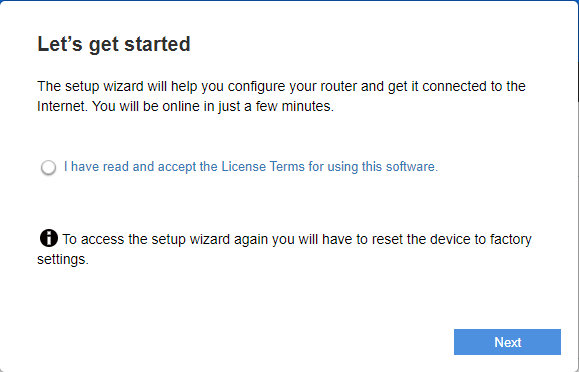
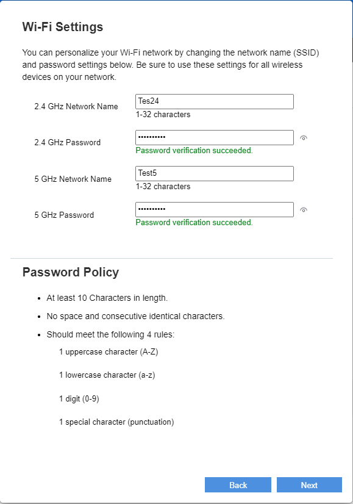
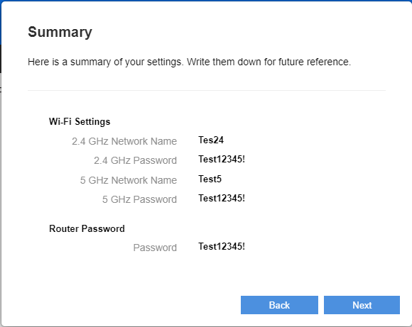
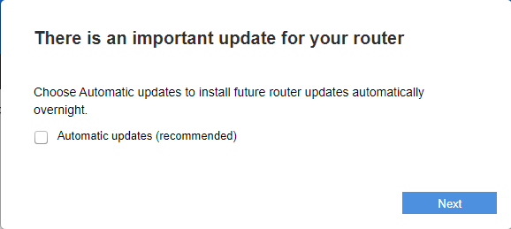
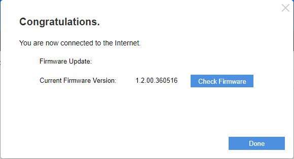
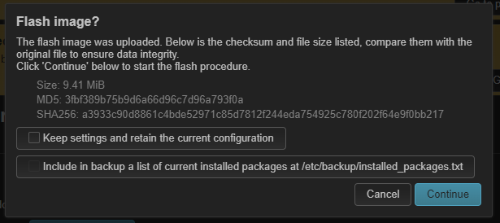
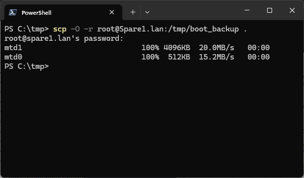
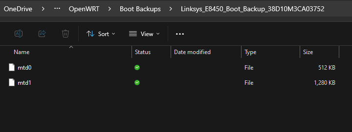

Exit code: 0
Wall time: 0.6 seconds
Output:
# Flashing OpenWrt on the Linksys E8450

## Determine your upgrade path

The correct procedure depends on the firmware and flash layout currently installed on the router.

| Current router state | Required action |
|---|---|
| Stock Linksys firmware | [Run the one-time installer](#first-time-openwrt-installation), then install official OpenWrt or the custom image |
| OpenWrt 23.05.x or older | [Migrate the older OpenWrt layout](#migrate-an-older-openwrt-layout) before installing an OpenWrt 24.10.x-or-newer image |
| OpenWrt snapshot from before February 15, 2024 | [Migrate the older OpenWrt layout](#migrate-an-older-openwrt-layout) before installing a newer image |
| OpenWrt 24.10.x | Do not rerun the installer; go to [Install the final firmware](#install-the-final-firmware) |
| OpenWrt snapshot using the post-February 2024 layout | Do not rerun the installer; go to [Install the final firmware](#install-the-final-firmware) |
| OpenWrt 23.05.x upgrading only to 23.05.4 | The layout-migration installer is not required |

> [!WARNING]
> OpenWrt 23.05.x and snapshots from before [February 15, 2024](https://git.openwrt.org/?p=openwrt/openwrt.git;a=commitdiff;h=6aec3c7b5bf5e5a999a12121dfa71963afb6f003) use the older E8450 UBI layout. OpenWrt 24.10.x and newer images require the layout that places the FIP and factory data in UBI. Do not flash a 24.10.x-based sysupgrade image directly over the older layout.

> [!IMPORTANT]
> The E8450 installation and migration requirements can change. Before flashing, compare this guide with the current [OpenWrt device page](https://openwrt.org/toh/linksys/e8450) and [official UBI installer documentation](https://github.com/dangowrt/owrt-ubi-installer). Those upstream sources take precedence for installer choice and layout migrations.
  
> [!CAUTION]
> Do not use installer v1.0.3. Select the current installer release recommended by the upstream UBI installer project; do not rely on a version number copied from an older guide. The installer changes the bootloader and flash layout and normally must be run only once per device.

## Migrate an older OpenWrt layout

This path applies when upgrading OpenWrt 23.05.x or older—or a snapshot from before February 15, 2024—to OpenWrt 24.10.x or a newer release.

1. [Copy the existing vendor bootchain backup off the router](#back-up-the-stockvendor-bootchain) before changing the layout. Verify the files and retain them permanently.
2. Read the current [OpenWrt E8450 migration instructions](https://openwrt.org/toh/linksys/e8450).
3. Download the installer currently recommended by the [E8450 UBI installer project](https://github.com/dangowrt/owrt-ubi-installer/releases).
4. Follow the upstream instructions to run that installer once.
5. Continue with [Install the final firmware](#install-the-final-firmware).

> [!CAUTION]
> Once the router uses the current UBI layout, do not run the installer again unless new upstream instructions explicitly require another bootloader or layout migration. Use normal E8450 UBI sysupgrade images for subsequent upgrades.

## First-time OpenWrt installation

1. Factory Reset the router by holding down the reset button until the Power LED indicator starts blinking. Wait for the device to reset. If the device is brand new, this step is not required.
  
- **IMPORTANT**: If a device running stock 1.1.x firmware rejects the installer image, the recommended work-around is to downgrade the device to version 1.0.x, and then re-attempt uploading the installer image. See "Downgrading Firmware" instructions below.
  
- **IMPORTANT**: Execute these steps on a brand new device running stock firmware ...or... just after performing a factory reset on the device.
  
2. Connect any of the LAN ports of the device directly to the Ethernet port of your computer.
  
3. Set the IP address of your computer as 192.168.1.254 with netmask 255.255.255.0, no gateway, no DNS.
  
4. Power on the device, wait about a minute for it to be ready.
  
5. Open a web browser, navigate to http://192.168.1.1 and wait for the wizard to come up.
  
6. Click exactly inside the radio button to confirm the terms and conditions, then abort the wizard. (Complete the wizard if you are running stock firmware version 1.2.x)
  
    
  
7. You should then be greeted by the login screen; the stock password is "admin".
  
    
  
8. If the firmware on the device is >= 1.2.00, then you will have to go through the process of setting to WAN on the device before proceeding.
  
    
  
    `Set temporary password`
  
    
  
    `Next`
  
    
  
    `No, I’m done.`
  
    
  
    `Skip`
  
    
  
    `Next`
  
    
  
    `Make note of the factory firmware version. Done.`
  
    
  
    `Done`
  
    
  
9. Navigate to `Administration -> Firmware Upgrade`.

    
  
10. Upload the firmware **installer** image. This one-time installer converts the router's NAND flash layout to UBI and starts the OpenWrt recovery environment. It is not the final OpenWrt firmware image.
  
    - If running stock **firmware < 1.2.00.273012**, upload the **unsigned** image: `openwrt-...-mediatek-mt7622-linksys_e8450-ubi-initramfs-recovery-installer.itb`
  
    - Otherwise, when stock **firmware is >= 1.2.00.273012**, upload the **signed** image: `openwrt-...-mediatek-mt7622-linksys_e8450-ubi-initramfs-recovery-installer_signed.itb`
  
        

        
  
11. Wait for a minute, the OpenWrt recovery image should come up.

    
  
12. Login as `root` user. By default, there is no password.

## Install the final firmware

Continue here after the one-time installer or an explicitly required layout migration. If the router already runs OpenWrt 24.10.x or another release using the current UBI layout, skip the installer, sign in to LuCI, and begin here instead.

13. Navigate to `System -> Backup / Flash Firmware`.

    
  
14. Choose and upload one of the following E8450 UBI sysupgrade images:

    At this stage, the installer has finished its job and the router is ready for its final firmware. If you want the custom image, you may install it directly; installing official OpenWrt first is not required.

    | Choice | Image |
    |---|---|
    | Official OpenWrt | `openwrt-...-mediatek-mt7622-linksys_e8450-ubi-squashfs-sysupgrade.itb` downloaded from OpenWrt |
    | Custom image | Download the latest `linksys_e8450-ubi-squashfs-sysupgrade.itb` artifact from this project's [Releases](https://github.com/foxrid3r/openwrt/releases) page|


    Use only an image built for the Linksys E8450 UBI profile. The screenshots show an official OpenWrt image, but the upload workflow is the same for the custom image.

    

    

    

    
  
15. Do not retain any settings.

    
  
16. The device will reboot. After a first-time UBI conversion, continue immediately with the stock/vendor bootchain backup below. For an existing OpenWrt installation, confirm that its original bootchain backup is already stored safely off the router.
  
  
## Back up the stock/vendor bootchain

> [!IMPORTANT]
>
> Do not skip this backup. The UBI installer preserves the router's original vendor bootchain in a `boot_backup` volume before replacing the Linksys boot environment. This data is specific to the individual router and may be required to restore vendor firmware or perform advanced recovery.
>
> A downloaded Linksys firmware image is not an equivalent replacement for `boot_backup`. Copy the backup off the router immediately after the first OpenWrt installation and retain it permanently.
>
> If the stock bootchain has already been verified to exist in a safe and permanent location, then there is no need to make another backup.
>
>If an installer has been run more than once on the device, the stock bootchain cannot be recovered from the device.

### Overview

The first installation of OpenWrt on a Linksys E8450 is different from a normal firmware upgrade. The recommended installation process uses a **UBI installer** that restructures the router's NAND flash, installs an OpenWrt-compatible bootchain, and creates the UBI-based flash layout used by subsequent OpenWrt releases.

Because this conversion replaces portions of the original Linksys boot environment, the installer first preserves the existing vendor boot information in a dedicated backup volume on the router. That backup is an important device-specific recovery asset and should be copied off the router immediately after the initial OpenWrt installation.

### What happens during the initial installation

A factory Linksys E8450 uses a Linksys-specific NAND layout containing the bootloader, firmware, factory data, configuration information, and other partitions. OpenWrt's UBI installation uses a substantially different layout.

The one-time recovery installer is therefore not a normal firmware upgrade. At a high level, it:

1. Boots a temporary OpenWrt recovery and installation environment.
2. Reads the existing contents of the router's NAND flash.
3. Preserves the existing vendor bootchain in a backup.
4. Reorganizes the NAND flash into the OpenWrt UBI layout.
5. Installs the OpenWrt-compatible bootloader infrastructure.
6. Creates the UBI volumes used by OpenWrt.
7. Starts the recovery environment used to install the final firmware.

The important point is that the installer creates the backup **before replacing the original boot environment**.

### The `boot_backup` UBI volume

During conversion, the installer creates a dedicated UBI volume named:

```text
boot_backup
```

A typical E8450 UBI layout contains volumes such as:

```text
ubi0
├── fip
├── factory
├── ubootenv
├── ubootenv2
├── recovery
├── fit
├── boot_backup
└── rootfs_data
```

The `boot_backup` volume contains the data saved before the installer modifies the router's original boot environment. On a router converted directly from Linksys firmware, it preserves vendor bootchain information that may be needed to reconstruct the original flash layout and return to the vendor firmware.

### What is actually backed up?

`boot_backup` is not simply another copy of the downloadable Linksys firmware image. The factory NAND contains multiple components associated with booting and the vendor flash layout, including items such as:

```text
Preloader
ATF
Bootloader
Config
Factory
Kernel1
Kernel2
```

The UBI conversion replaces or reorganizes portions of that layout. A downloaded stock firmware image does not necessarily contain everything needed to reconstruct the original boot environment after conversion.

Some preserved data may also be specific to the physical router, including hardware calibration information and identifiers. A backup from another Linksys E8450 should not be treated as an equivalent replacement.

### Why the backup is important

Returning an E8450 to Linksys firmware after UBI conversion is more involved than uploading a vendor firmware image through LuCI. The original boot information in `boot_backup` can be required to reconstruct the Linksys flash layout and may also be valuable during advanced recovery if the bootloader, layout, or other critical partitions become damaged.

Leaving the only copy on the router is inadequate: storage failure, accidental erasure, or unnecessarily rerunning the installer could destroy it. Treat the externally stored copy as a permanent recovery asset belonging to that specific router.

### Copy the backup

1. Connect to the router over SSH as `root`.

2. Create a temporary mount point and mount the installer-created `boot_backup` volume:

    ```sh
    mkdir -p /tmp/boot_backup
    mount -t ubifs ubi0:boot_backup /tmp/boot_backup
    ```

    

3. Confirm that the backup files are present:

    ```sh
    ls -lh /tmp/boot_backup
    ```

4. Copy every file from `/tmp/boot_backup` to another computer using SCP, WinSCP, or an equivalent tool.

    For example, from a computer with `scp`:

    ```sh
    scp root@<router-ip>:/tmp/boot_backup/* <local-backup-directory>/
    ```

    

5. Verify that the copied files can be read, then label the backup with the router's model and serial number. Store it in a protected location that is backed up separately.

    

> [!NOTE]
>
> With installer v1.1.x and newer, `boot_backup` may contain only `mtd0` and `mtd1`. Older installers may have created `mtd0`, `mtd1`, `mtd2`, and `mtd3`. Copy every file that exists; do not substitute files from another router.

### Do not rerun the installer unnecessarily

The UBI installer is for the initial conversion from the Linksys flash layout to OpenWrt UBI. Running it again can replace the contents of `boot_backup` and destroy the only on-router copy of the original vendor bootchain.

After conversion, use the appropriate `linksys_e8450-ubi-squashfs-sysupgrade.itb` image for normal upgrades. Run another installer only when current upstream OpenWrt instructions explicitly require a bootloader or flash-layout migration, and make sure the original backup already exists off the router.

# Related Documentation

- [Router Provisioning](provisioning.md)
- [DHCP Modes](../tools/dhcp-mode.md)
- [DHCP Range Configuration](../tools/set-dhcp-range.md)
- [DHCP Lease Reclamation](../tools/dhcp-lease-reclamation.md)
- [FTP Server](../custom-image/ftp-service.md)
- [NTP](../custom-image/ntp-uplink.md)
- [USB Storage](../custom-image/usb-storage.md)
- [Tool Reference](../tools/README.md)
