# Flashing & Setting Up OpenWrt on Linksys E8450
  
## Version: 1.3
  
As of 2026-04-30, the maintainer for the Linksys E8450 for OpenWrt is [Daniel Golle](https://github.com/dangowrt ). If flashing OpenWrt to this device for the first time, please familiarize yourself with the [GitHub](https://github.com/dangowrt/owrt-ubi-installer ) and [OpenWrt Wiki](https://openwrt.org/toh/linksys/e8450) pages for this device.
  
## ***CAUTION***
  
**DO NOT USE** installer v1.0.3. There is a bug within the installer that leaves these routers at risk of OKD.
  
**As of 2026-04-30, use Installer v.1.1.4**
  
# Flashing OpenWrt
1. Factory Reset the router by holding down the reset button until the Power LED indicator starts blinking. Wait for the device to reset. If the device is brand new, this step is not required.
  
- **IMPORTANT**: If a device running stock 1.1.x firmware rejects the installer image, the recommended work-around is to downgrade the device to version 1.0.x, and then re-attempt uploading the installer image. See "Downgrading Firmware" instructions below.
  
- **IMPORTANT**: Execute these steps on a brand new device running stock firmware ...or... just after performing a factory reset on the device.
  
2. Connect any of the LAN ports of the device directly to the Ethernet port of your computer.
  
3. Set the IP address of your computer as 192.168.1.254 with netmask 255.255.255.0, no gateway, no DNS.
  
4. Power on the device, wait about a minute for it to be ready.
  
5. Open a web browser, navigate to http://192.168.1.1 and wait for the wizard to come up.
  
6. Click exactly inside the radio button to confirm the terms and conditions, then abort the wizard. (Complete the wizard if you are running stock firmware version 1.2.x)
  
    
  
7. You should then be greeted by the login screen; the stock password is "admin".
  
    
  
8. If the firmware on the device is >= 1.2.00, then you will have to go through the process of setting to WAN on the device before proceeding.
  
    
  
    `Set temporary password`
  
    
  
    `Next`
  
    
  
    `No, I’m done.`
  
    
  
    `Skip`
  
    
  
    `Next`
  
    
  
    `Make note of the factory firmware version. Done.`
  
    
  
    `Done`
  
    
  
9. Navigate to `Administration -> Firmware Upgrade`.

  
10. Upload the firmware **installer** image. The purpose of this file is to convert the NAND flash layout on the router to UBI and get the router into a recovery state which will be used to upload a stock OpenWrt image for this router.
  
    - If running stock **firmware < 1.2.00.273012**, upload the **unsigned** image: `openwrt-...-mediatek-mt7622-linksys_e8450-ubi-initramfs-recovery-installer.itb`
  
    - Otherwise, when stock **firmware is >= 1.2.00.273012**, upload the **signed** image: `openwrt-...-mediatek-mt7622-linksys_e8450-ubi-initramfs-recovery-installer_signed.itb`
  
    
    
  
11. Wait for a minute, the OpenWrt recovery image should come up.

  
12. Login at `root`. By default, there is no password.
  
13. Navigate to `System -> Backup / Flash Firmware`.

  
14. Upload `openwrt-...-mediatek-mt7622-linksys_e8450-ubi-squashfs-sysupgrade.itb`. This is the stock OpenWrt image for this router.


  
15. Do not retain any settings.

  
15. The device will reboot, you may proceed to backing up the stock/vendor bootchain.
  
  
# Backup stock/vendor bootchain
These files are needed in case you want to restore the original/vendor firmware. They can also be used in emergency case for reflashing via JTAG.
  
1. SSH into the router using Putty or terminal. Make a backup of the bootchain as shown below.

  
2. Connect to router using WinSCP

  
3. Copy `MTD` files out and save in a secure location, indicating which serial number these files belong to. **NOTE**: Since Installer v1.1.x, the boot backups are stored solely in **mtd0** and **mtd1**, so if those are the only 2 files in the **boot_backup** directory, this is expected. The screenshots below was taken during an installation while using v1.0.2 installer which stored the backup in 4 files (mtd0, mtd1, mt2, & mtd3).


<div style="page-break-after: always;"></div>
  
  
## Custom Image Installation
A custom firmware image is a version of OpenWrt that has been pre-built with specific packages, configurations, and features already included. Instead of starting with a generic, default system and manually configuring each setting, the image is tailored ahead of time to meet a particular need or application.

This approach is useful because it shifts the work from repetitive manual setup to a one-time, controlled build process. The result is a ready-to-deploy system that behaves predictably across all devices it is installed on.

For end users, this provides several practical advantages:

- ⚙️ Reduced setup time – devices are ready to use immediately after flashing
- 🔁 Consistency – every device runs the same configuration, eliminating variation
- 🧩 Pre-installed features – required tools and services are already included
- 🛠️ Simplified support – standardized systems are easier to troubleshoot and maintain
- 🔒 Controlled environment – only the necessary components are included, reducing complexity and potential issues

In short, a custom image allows systems to be deployed quickly, reliably, and with confidence that they will operate exactly as intended.

The steps below outline how to go about installing the custom image on a Linksys E8450 which has already been flashed with OpenWrt.
  
`System > Backup/Flash Firmware`
  

  
`Flash new firmware image > Flash image…`
  

  
`Browse…`
  

  
Select the Calvary custom image, `Calvary-openwrt-24.10.5-mediatek-mt7622-linksys_e8450-ubi-squashfs-sysupgrade.itb`
  

  
`Upload`
  

  
`Do not retain any settings. Continue.`
  


<div style="page-break-after: always;"></div>

  
<!-- INCLUDE: Custom OpenWrt Image.md -->

<div style="page-break-after: always;"></div>

<!-- INCLUDE: Custom DHCP Modes.md -->

<div style="page-break-after: always;"></div>

<!-- INCLUDE: Set DHCP Range.md -->

<div style="page-break-after: always;"></div>

<!-- INCLUDE: DHCP Lease Reclamation.md -->

<div style="page-break-after: always;"></div>

<!-- INCLUDE: Setting Up NTP.md -->

<div style="page-break-after: always;"></div>

<!-- INCLUDE: Setting Up FTP Server.md -->

<div style="page-break-after: always;"></div>

<!-- INCLUDE: Auto Mount USB Drive.md -->

<div style="page-break-after: always;"></div>
  
  
## Manual Setup Method
  
This section is not well maintained, but may be used as a rough guide to get familiar with setting up a router in OpenWrt. Instead of manually setting up the router, it is recommended to use the Calvary custom OpenWrt image that has been created and is maintained to simplify the setup process.
  
`System > General`
  
- Set Hostname
  
- Sync Local Time with browser
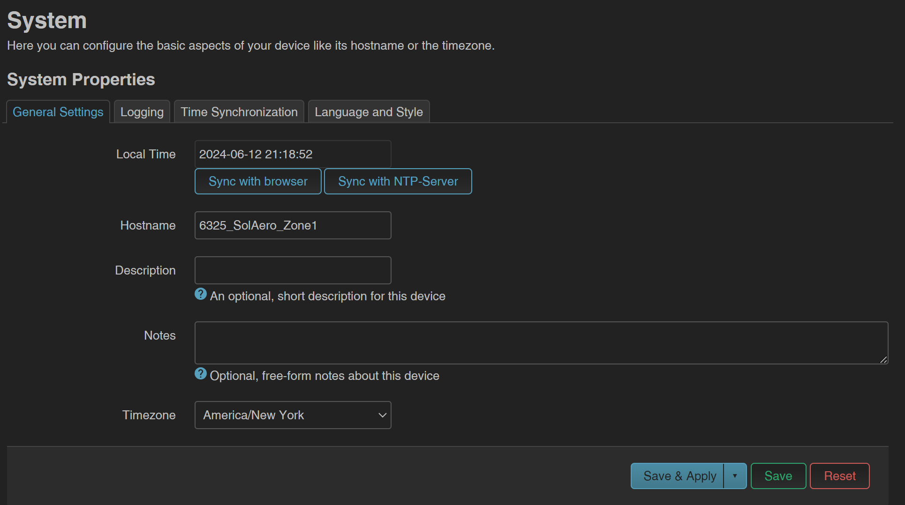
  
`Network > Interfaces`
- Edit lan interface
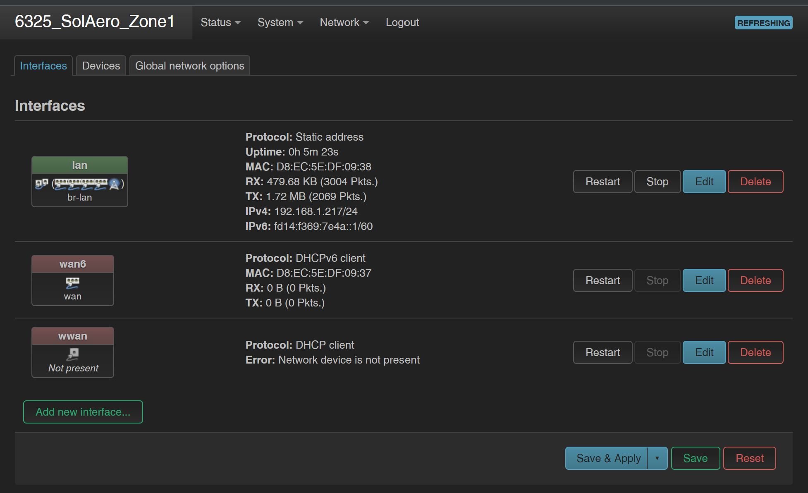
  
- Set IPv4 router address and subnet mask
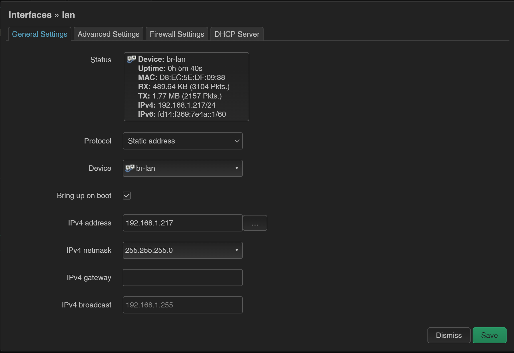
  
    `DHCP Server`
  
    - Set starting DHCP address and number of addresses (Limit)
    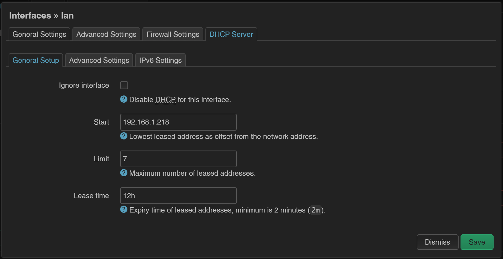
  
`Network > Wireless`
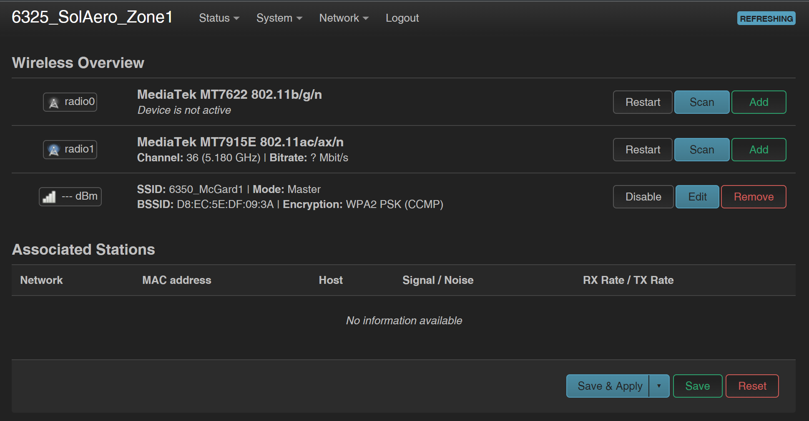
  
- Edit one of the radios and make it a Client
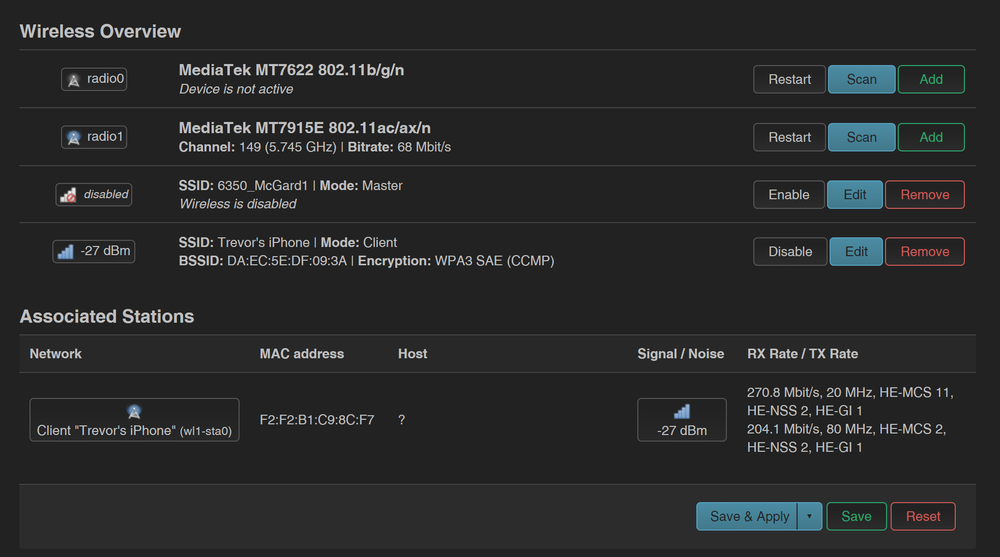
  
- Start WWAN
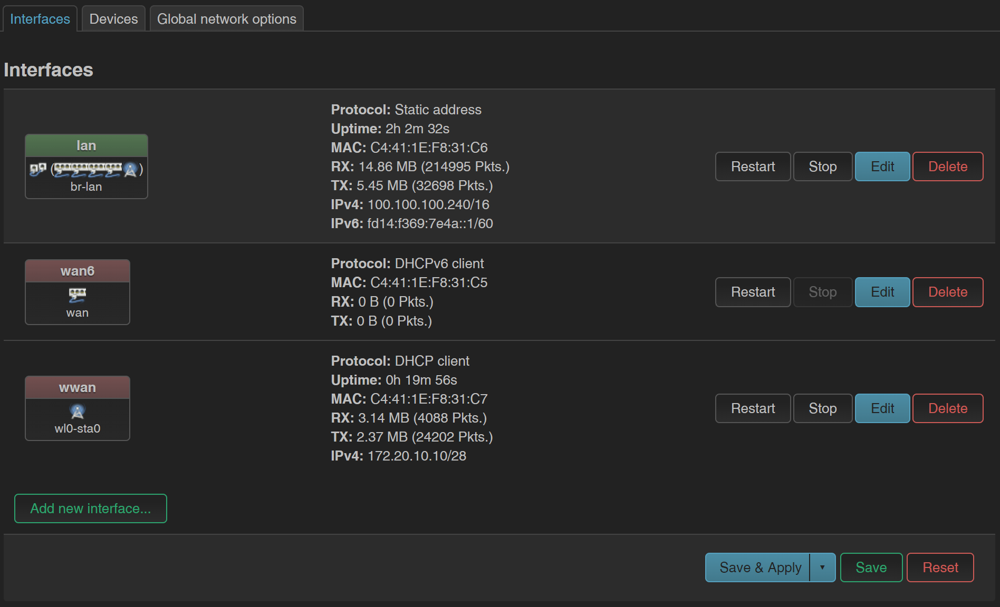
  
- Connect via Putty
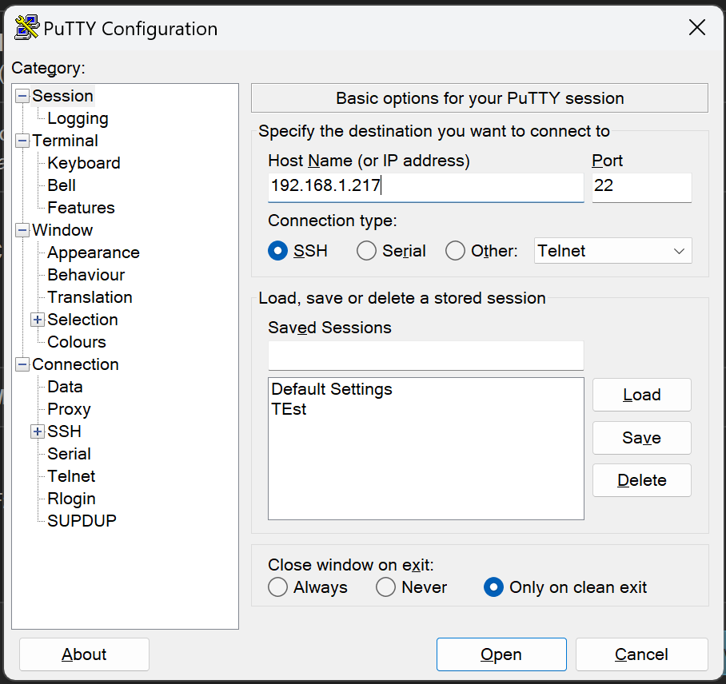
  
## Package Update
- Login
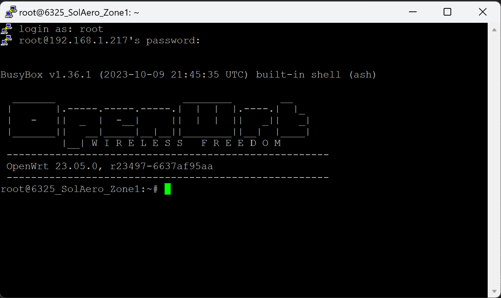
  
- Update package list
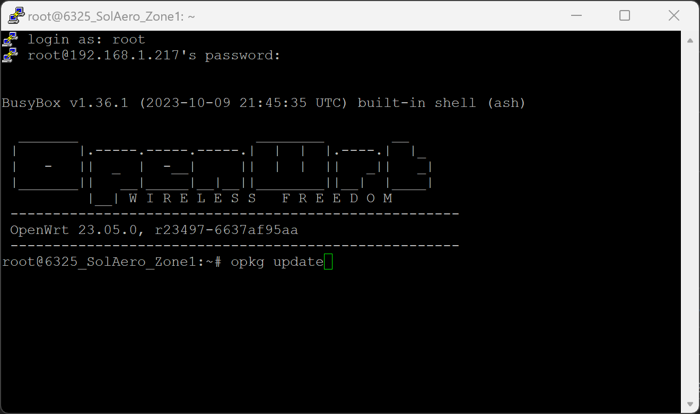
  
- Install packages
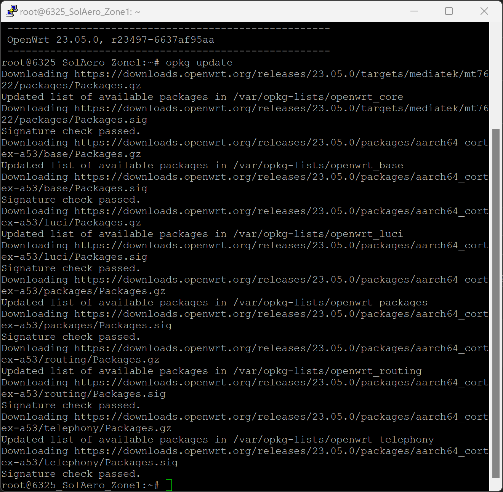
  
    - block-mount
    - gdisk
    - nano
    - vsftpd
    - kmod-fs-exfat
    - kmod-usb-storage
    - kmod-usb3
    - kmod-usb-storage-uas
    - usbutils
    - libblkid
    - kmod-nft-bridge
    - nftables
  
## opkg update
  
opkg install block-mount gdisk nano vsftpd kmod-fs-exfat kmod-usb-storage kmod-usb3 kmod-usb-storage-uas usbutils libblkid kmod-nft-bridge nftables
  
It doesn’t appear that this section is needed.
  
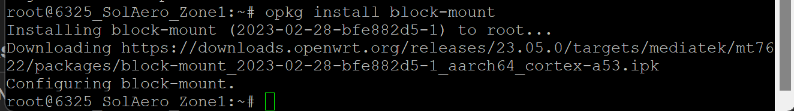
  
## Reboot to see Mount Points option under System tab
  
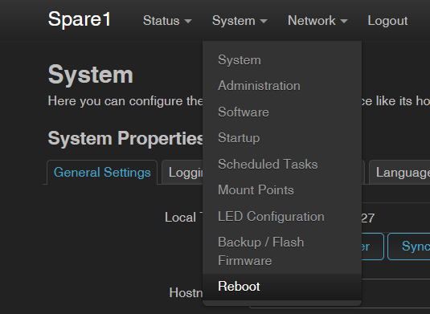
  
## Go to System > Mount Points
  
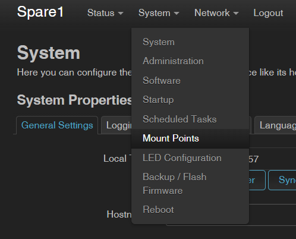
  
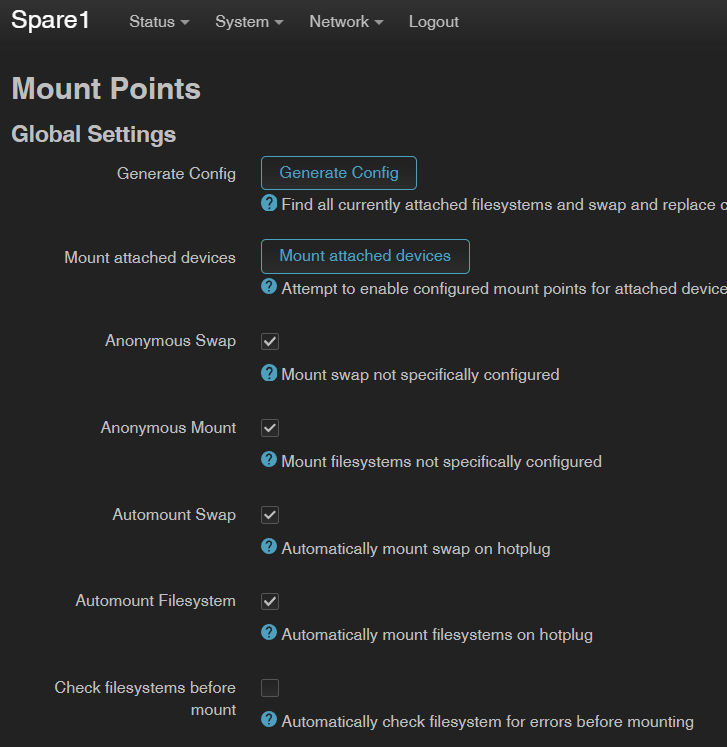
  
## Set wireless SSID
  
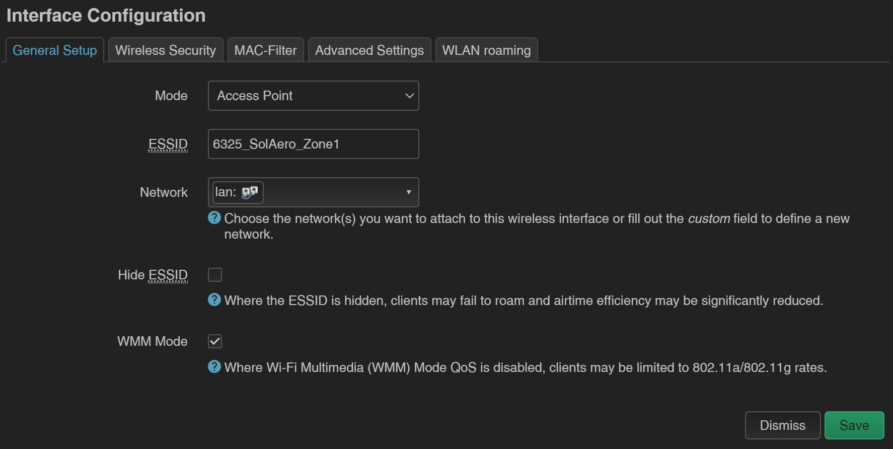
  
## Remove internet access
  
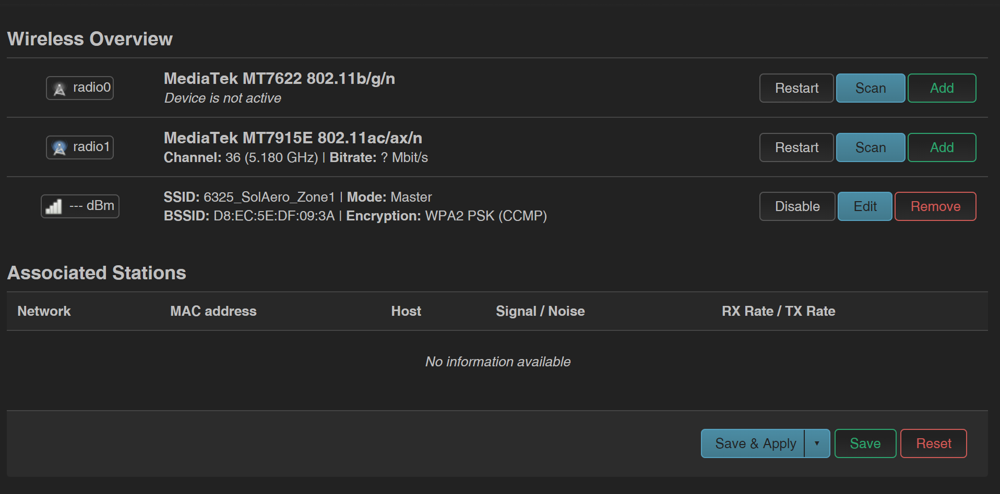
  
## Disable DHCP for wired devices (except Cognex devices)
  
`opkg install kmod-nft-bridge nftables`
  
`/usr/share/nftables.d/ruleset-pre/ruleset-pre/1-dhcp-drop-wired.nft`
  
```
table bridge filter
  
flush table bridge filter
  
table bridge filter {
  
chain input {
  
type filter hook input priority -200; policy accept;
  
# Allow DHCP DISCOVER/REQUEST from Cognex devices on wired ports
  
iifname { "lan1", "lan2", "lan3", "lan4" } \
  
ether saddr & ff:ff:ff:00:00:00 == 00:d0:24:00:00:00 \
  
ip protocol udp udp dport 67 counter accept
  
# Drop all other DHCP client->server on wired ports
  
iifname { "lan1", "lan2", "lan3", "lan4" } ip protocol udp udp dport 67 counter drop
  
}
  
chain output {
  
type filter hook output priority 100; policy accept;
  
# Allow DHCP OFFER/ACK to Cognex devices on wired ports
  
oifname { "lan1", "lan2", "lan3", "lan4" } \
  
ether daddr & ff:ff:ff:00:00:00 == 00:d0:24:00:00:00 \
  
ip protocol udp udp sport 67 counter accept
  
# Drop all other DHCP server->client on wired ports
  
oifname { "lan1", "lan2", "lan3", "lan4" } ip protocol udp udp sport 67 counter drop
  
}
  
}
```
  
Reboot the router or restart the firewall service using: /etc/init.d/firewall restart
  
## FTP Server Configuration
  
`/etc/vsftpd.conf`
  
```
# -----------------------------------------------------------------------------
# Basic server mode
# -----------------------------------------------------------------------------
  
listen=YES
# Run vsftpd in standalone mode, listening on IPv4 sockets.
# (Required when not using inetd/systemd socket activation.)
  
listen_ipv6=NO
# Disable IPv6 listening. Only IPv4 connections will be accepted.
  
background=YES
# Run vsftpd as a background daemon instead of blocking the terminal.
  
# -----------------------------------------------------------------------------
# Authentication & user access
# -----------------------------------------------------------------------------
  
anonymous_enable=NO
# Disable anonymous FTP access.
# All users must authenticate with a valid local system account.
  
local_enable=YES
# Allow local system users (from /etc/passwd) to log in via FTP.
  
write_enable=YES
# Enable write operations (upload, delete, rename files/directories).
# Required for any user who needs to modify files.
  
# -----------------------------------------------------------------------------
# Chroot (filesystem isolation)
# -----------------------------------------------------------------------------
  
chroot_local_user=NO
# Do NOT chroot all local users by default.
# Chroot behavior will instead be controlled using a chroot list.
  
chroot_list_enable=YES
# Enable selective chrooting using a list file.
  
chroot_list_file=/etc/vsftpd.chroot
# File containing usernames that SHOULD be chrooted
# (i.e., restricted to their home directory).
# One username per line.
  
allow_writeable_chroot=YES
# Allow users to be chrooted into directories that are writable.
# This is often required for embedded systems (like OpenWRT),
# but should be enabled only when you trust the users.
  
# -----------------------------------------------------------------------------
# Per-user configuration
# -----------------------------------------------------------------------------
  
user_config_dir=/etc/vsftpd.users
# Directory containing optional per-user configuration files.
  
# If a file named after the username exists here, its settings
# will override global settings for that user.
  
# -----------------------------------------------------------------------------
# User allow/deny list
# -----------------------------------------------------------------------------
  
userlist_enable=YES
# Enable user access control using a user list file.
  
userlist_file=/etc/vsftpd.userlist
# File containing usernames that are allowed or denied FTP access,
# depending on the userlist_deny setting.
  
userlist_deny=NO
# Treat the userlist as an ALLOW list.
# Only users listed in /etc/vsftpd.userlist are permitted to log in.
  
# -----------------------------------------------------------------------------
# Logging
# -----------------------------------------------------------------------------
  
xferlog_enable=YES
# Enable logging of file transfers (uploads/downloads).
  
log_ftp_protocol=YES
# Enable verbose logging of all FTP protocol commands and responses.
# Useful for debugging authentication, permissions, and client behavior.
  
```
  
`/etc/vsftpd.chroot`
  
```
admin
```
  
`/etc/vsftpd.userlist`
  
```
admin
```
  
`/etc/vsftpd.users/admin`
  
```
local_root=/mnt/usb/FTP
```
  
## Setting Up Time Synchronization (NTP) Using a Second WiFi Radio
  
This guide explains how to configure your router to obtain accurate time from the internet using a secondary WiFi connection, while keeping your primary machine network completely isolated.
  
## Step 1 — Connect the Second Radio to an Internet WiFi Network
  
Go to Network → Wireless.
  
On the unused radio, click Scan.
  
Find a WiFi network that has internet access.
  
Click Join Network.
  
Set Mode to Client.
  
When prompted to create or assign an interface, choose Create new interface.
  
Name the interface wwan_guest.
  
Click Save & Apply.
  
## Step 2 — Configure the Guest WiFi Interface
  
Go to Network → Interfaces.
  
Click Edit on wwan_guest.
  
Open the Advanced Settings tab.
  
Check Use default gateway.
  
Uncheck Use DNS servers advertised by peer.
  
Set Gateway metric to 50.
  
Click Save & Apply.
  
This allows the router to use the connection for time synchronization without turning it into the primary internet connection.
  
## Step 3 — Firewall Isolation (Prevent Network Mixing)
  
Create a firewall zone to keep the guest WiFi separated from your machine network.
  
Go to Network → Firewall.
  
Click Add to create a new firewall zone.
  
Name the zone guestwan.
  
Set Input to REJECT.
  
Set Output to ACCEPT.
  
Set Forward to REJECT.
  
Ensure Masquerading is unchecked.
  
Ensure MSS Clamping is unchecked.
  
Add the network wwan_guest to this zone.
  
Save & Apply.
  
Do NOT allow forwarding between lan and guestwan in either direction.
  
## Step 4 — Configure Time Synchronization
  
Go to System → System.
  
Click the Time Synchronization tab.
  
Check Enable NTP client.
  
Check Provide NTP server.
  
## Add the following NTP server IP addresses:
  
**129.6.15.28 (NIST – Maryland)**
  
**132.163.96.1 (NIST – Colorado)**
  
Click Save & Apply.
  
Using IP addresses avoids needing DNS access on the guest network.
  
## Step 5 — Add Static Routes for NTP Only
  
Go to Network → Routing.
  
Click the Static IPv4 Routes tab.
  
Click Add and create a route with Target 129.6.15.28/32, leave Gateway blank, Interface wwan_guest.
  
Click Add and create a route with Target 132.163.96.1/32, leave Gateway blank, Interface wwan_guest.
  
Click Save & Apply.
  
## Final Result
  
The router receives accurate time from the internet.
  
The machine or PLC network remains fully isolated.
  
No traffic passes between the guest WiFi and machine network.
  
Only time synchronization traffic uses the guest connection.
  