# Flashing & Setting Up OpenWrt on Linksys E8450
  
## Version: 1.3
  
As of 2026-04-30, the maintainer for the Linksys E8450 for OpenWrt is [Daniel Golle](https://github.com/dangowrt ). If flashing OpenWrt to this device for the first time, please familiarize yourself with the [GitHub](https://github.com/dangowrt/owrt-ubi-installer ) and [OpenWrt Wiki](https://openwrt.org/toh/linksys/e8450) pages for this device.
  
## ***CAUTION***
  
**DO NOT USE** installer v1.0.3. There is a bug within the installer that leaves these routers at risk of OKD.
  
**As of 2026-04-30, use Installer v.1.1.4**
  
# Flashing OpenWrt
1. Factory Reset the router by holding down the reset button until the Power LED indicator starts blinking. Wait for the device to reset. If the device is brand new, this step is not required.
  
- **IMPORTANT**: If a device running stock 1.1.x firmware rejects the installer image, the recommended work-around is to downgrade the device to version 1.0.x, and then re-attempt uploading the installer image. See "Downgrading Firmware" instructions below.
  
- **IMPORTANT**: Execute these steps on a brand new device running stock firmware ...or... just after performing a factory reset on the device.
  
2. Connect any of the LAN ports of the device directly to the Ethernet port of your computer.
  
3. Set the IP address of your computer as 192.168.1.254 with netmask 255.255.255.0, no gateway, no DNS.
  
4. Power on the device, wait about a minute for it to be ready.
  
5. Open a web browser, navigate to http://192.168.1.1 and wait for the wizard to come up.
  
6. Click exactly inside the radio button to confirm the terms and conditions, then abort the wizard. (Complete the wizard if you are running stock firmware version 1.2.x)
  
    
  
7. You should then be greeted by the login screen; the stock password is "admin".
  
    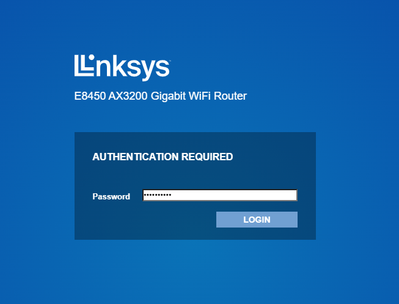
  
8. If the firmware on the device is >= 1.2.00, then you will have to go through the process of setting to WAN on the device before proceeding.
  
    
  
    `Set temporary password`
  
    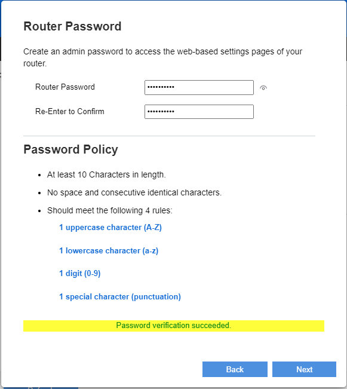
  
    `Next`
  
    
  
    `No, I’m done.`
  
    
  
    `Skip`
  
    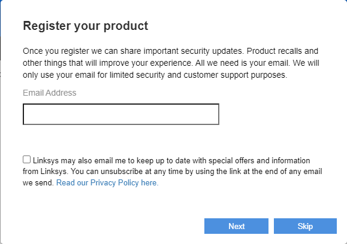
  
    `Next`
  
    
  
    `Make note of the factory firmware version. Done.`
  
    
  
    `Done`
  
    
  
9. Navigate to `Administration -> Firmware Upgrade`.
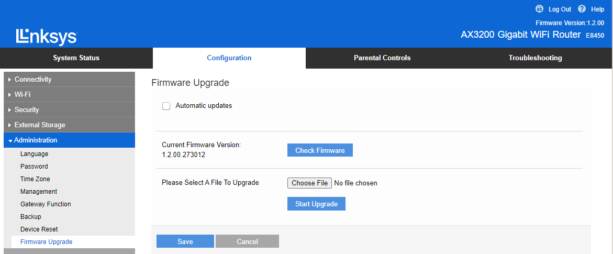
  
10. Upload the firmware **installer** image. The purpose of this file is to convert the NAND flash layout on the router to UBI and get the router into a recovery state which will be used to upload a stock OpenWrt image for this router.
  
    - If running stock **firmware < 1.2.00.273012**, upload the **unsigned** image: `openwrt-...-mediatek-mt7622-linksys_e8450-ubi-initramfs-recovery-installer.itb`
  
    - Otherwise, when stock **firmware is >= 1.2.00.273012**, upload the **signed** image: `openwrt-...-mediatek-mt7622-linksys_e8450-ubi-initramfs-recovery-installer_signed.itb`
  
    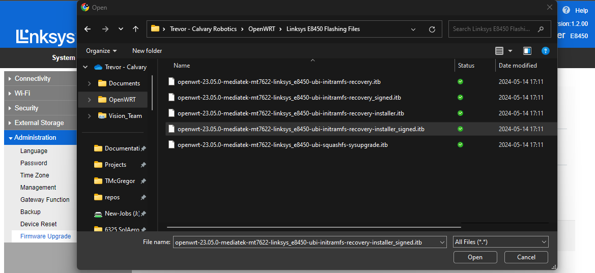
    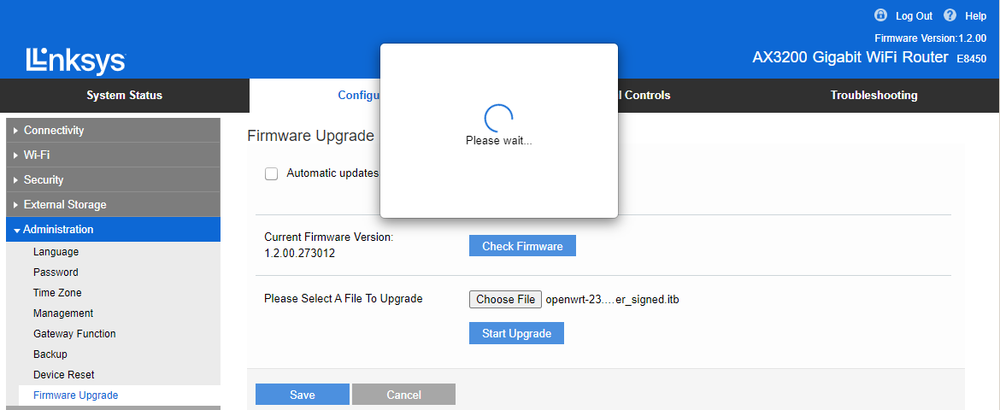
  
11. Wait for a minute, the OpenWrt recovery image should come up.

  
12. Login at `root`. By default, there is no password.
  
13. Navigate to `System -> Backup / Flash Firmware`.
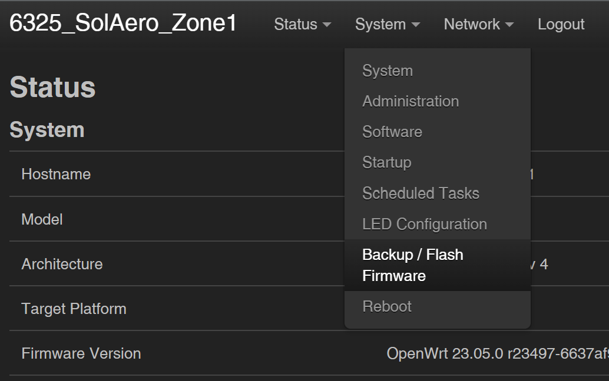
  
14. Upload `openwrt-...-mediatek-mt7622-linksys_e8450-ubi-squashfs-sysupgrade.itb`. This is the stock OpenWrt image for this router.
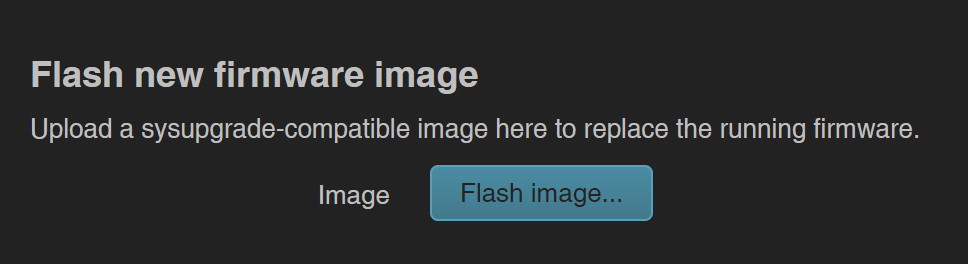

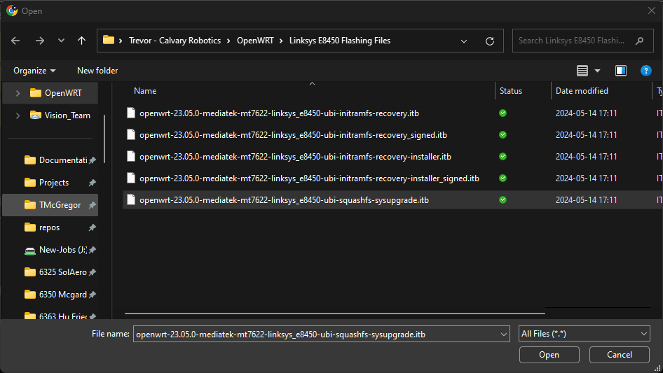

  
15. Do not retain any settings.

  
15. The device will reboot, you may proceed to backing up the stock/vendor bootchain.
  
  
# Backup stock/vendor bootchain
These files are needed in case you want to restore the original/vendor firmware. They can also be used in emergency case for reflashing via JTAG.
  
1. SSH into the router using Putty or terminal. Make a backup of the bootchain as shown below.

  
2. Connect to router using WinSCP
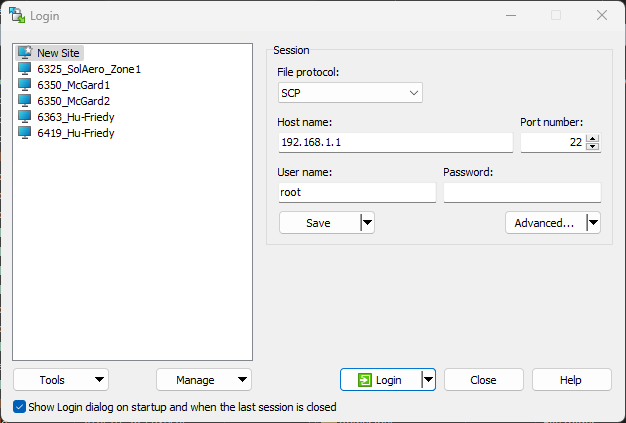
  
3. Copy `MTD` files out and save in a secure location, indicating which serial number these files belong to. **NOTE**: Since Installer v1.1.x, the boot backups are stored solely in **mtd0** and **mtd1**, so if those are the only 2 files in the **boot_backup** directory, this is expected. The screenshots below was taken during an installation while using v1.0.2 installer which stored the backup in 4 files (mtd0, mtd1, mt2, & mtd3).
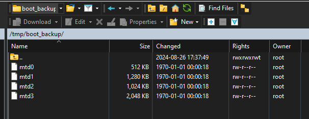
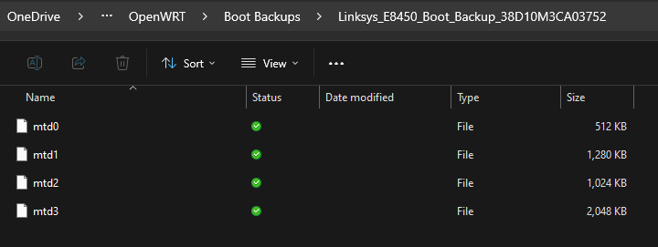

  
  
## Custom Image Installation
A custom firmware image is a version of OpenWrt that has been pre-built with specific packages, configurations, and features already included. Instead of starting with a generic, default system and manually configuring each setting, the image is tailored ahead of time to meet a particular need or application.

This approach is useful because it shifts the work from repetitive manual setup to a one-time, controlled build process. The result is a ready-to-deploy system that behaves predictably across all devices it is installed on.

For end users, this provides several practical advantages:

- ⚙️ Reduced setup time – devices are ready to use immediately after flashing
- 🔁 Consistency – every device runs the same configuration, eliminating variation
- 🧩 Pre-installed features – required tools and services are already included
- 🛠️ Simplified support – standardized systems are easier to troubleshoot and maintain
- 🔒 Controlled environment – only the necessary components are included, reducing complexity and potential issues

In short, a custom image allows systems to be deployed quickly, reliably, and with confidence that they will operate exactly as intended.

The steps below outline how to go about installing the custom image on a Linksys E8450 which has already been flashed with OpenWrt.
  
`System > Backup/Flash Firmware`
  

  
`Flash new firmware image > Flash image…`
  

  
`Browse…`
  

  
Select the Calvary custom image, `Calvary-openwrt-24.10.5-mediatek-mt7622-linksys_e8450-ubi-squashfs-sysupgrade.itb`
  

  
`Upload`
  

  
`Do not retain any settings. Continue.`
  

# Related Documentation

- [Router Provisioning](provisioning.md)
- [DHCP Modes](../networking/dhcp-modes.md)
- [DHCP Range Configuration](../networking/set-dhcp-range.md)
- [DHCP Lease Reclamation](../networking/dhcp-lease-reclamation.md)
- [FTP Server](../services/ftp.md)
- [NTP](../services/ntp.md)
- [USB Storage](../services/usb-storage.md)
- [Tool Reference](../tool-reference/tool-reference.md)
